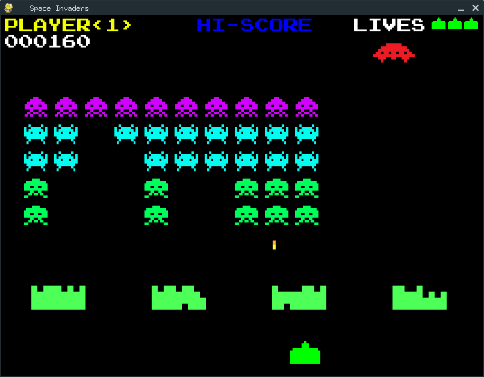

Space Invaders
===========

[](https://www.python.org)
[](http://www.pygame.org/news.html)
[](http://www.leejamesrobinson.com/space-invaders.html)

About
-----
I'm trying to replicate the exact original videogame as shown here:

[](https://www.youtube.com/watch?v=b5LZyAjcqQs)

I started by forking the original work of [Lee Robinson](mailto:lrobinson2011@gmail.com)


Space Invaders is a two-dimensional fixed shooter game in which the player controls a ship with lasers by moving it horizontally
across the bottom of the screen and firing at descending aliens. The aim is to defeat five rows of ten aliens that move
horizontally back and forth across the screen as they advance towards the bottom of the screen. The player defeats an alien,
and earns points, by shooting it with the laser cannon. As more aliens are defeated, the aliens' movement and the game's music
both speed up. 

The aliens attempt to destroy the ship by firing at it while they approach the bottom of the screen. If they reach the bottom,
the alien invasion is successful and the game ends. A special "mystery ship" will occasionally move across the top of the
screen and award bonus points if destroyed. The ship is partially protected by several stationary defense bunkers that are
gradually destroyed by projectiles from the aliens and player.



How To Play
----
Install Python and Pygame, and run the program in the command prompt / terminal.
 ``` bash
cd space-invaders
python spaceinvaders.py
 ```
 **Note:** If you're using Python 3, replace the command "python" with "python3"
